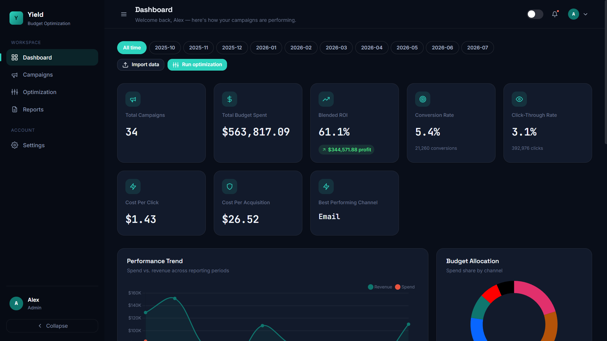
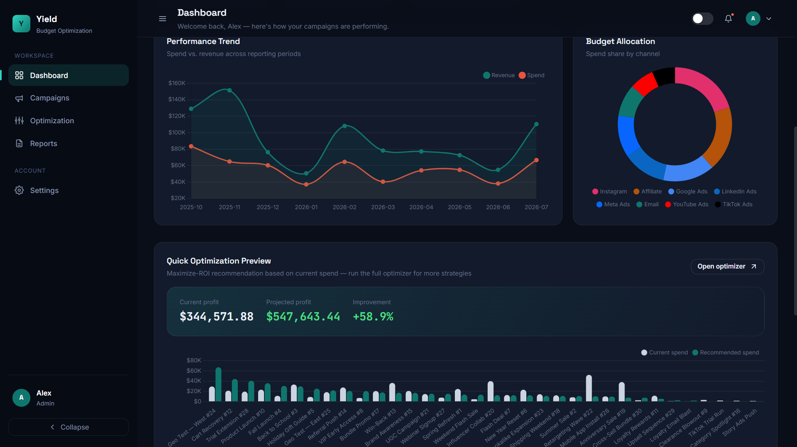
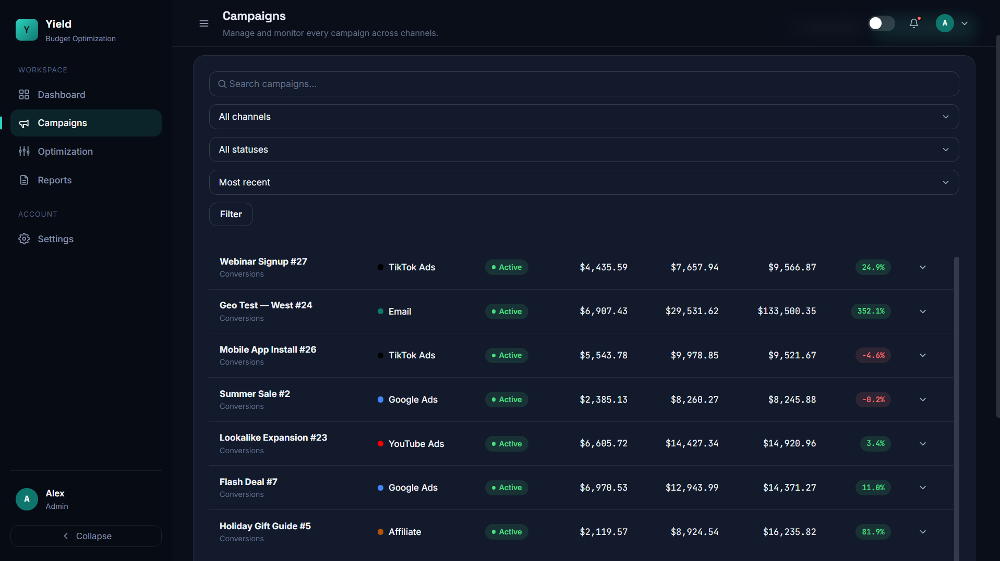
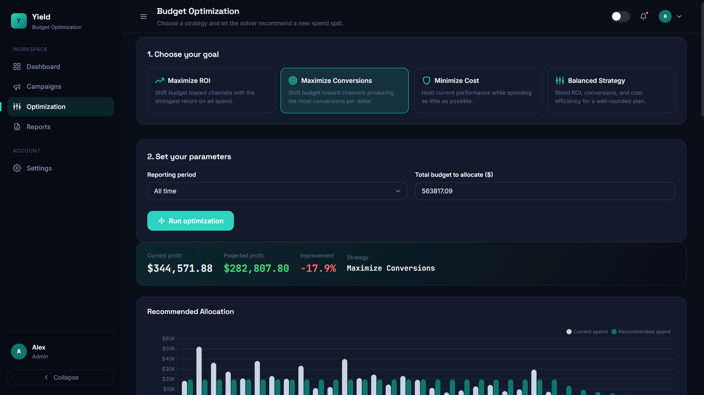
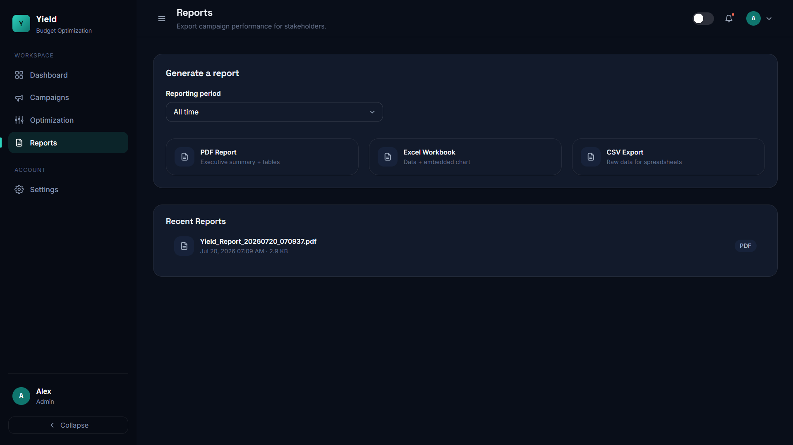

# Yield — Marketing Budget Optimization Platform

**🔗 Live demo:** [yield-marketing-budget-optimization.onrender.com](https://yield-marketing-budget-optimization.onrender.com)

> Hosted on Render's free tier — if it's been idle, the first load can take
> ~30–60 seconds to wake up. That's normal, not a bug.

## Screenshots

| | |
|---|---|
| **Login** | **Dashboard** |
|  |  |
| **Dashboard — trend & allocation** | **Campaigns** |
|  |  |
| **Budget Optimization** | **Reports** |
|  |  |

A production-style SaaS application that helps businesses optimize digital
marketing budgets using campaign performance data and non-linear
optimization (SciPy SLSQP).

Rebuilt from a single-file Flask prototype into a layered application with
Blueprints, a service layer, a normalized database schema, and a bespoke
design system inspired by tools like Stripe, Linear, and Google Analytics.

## Features

- **Multi-strategy budget optimizer** — Maximize ROI, Maximize Conversions,
  Minimize Cost, or a Balanced blend, powered by SciPy's SLSQP solver with a
  diminishing-returns model (`log1p`) so early spend matters more than the
  last dollar.
- **Campaign management** — create, edit, search, filter, sort, and
  paginate campaigns; drill into per-campaign history.
- **CSV / Excel import** — auto-maps common column names ("Spend",
  "Ad Spend", "Amount Spent" → Cost, etc.), auto-creates channels, and
  upserts metrics per reporting period so campaigns accumulate history
  across months instead of being overwritten.
- **Dashboard** — total campaigns, budget, ROI, conversion rate, CTR, CPC,
  CPA, best channel, spend trend, budget allocation donut, top campaigns by
  ROI, and a live quick-optimization preview.
- **Reporting** — polished PDF (ReportLab), Excel with an embedded chart
  (openpyxl), and CSV exports, with a history of generated reports.
- **Notifications & activity log** — in-app notification center and a full
  audit trail of logins, uploads, optimizations, and exports.
- **Auth & roles** — Admin / Agent / Viewer roles, hashed passwords,
  CSRF-protected forms, session cookies.
- **Light & dark mode**, responsive layout down to mobile, toasts, skeleton
  loaders, and an accessible, keyboard-friendly component set.

## Architecture

```
Routes (HTTP only) → Services (business logic) → Models (SQLAlchemy) → DB
```

```
app/
├── __init__.py          # application factory
├── extensions.py        # db, login_manager, csrf
├── models/              # user, channel, campaign, campaign_metric,
│                        # optimization, report, notification,
│                        # activity_log, setting
├── auth/                # login, register, logout
├── dashboard/           # KPI overview
├── campaigns/           # CRUD + CSV/Excel import
├── optimization/        # run optimizer, view history
├── reports/             # PDF / Excel / CSV export
├── settings/            # profile, preferences, security
├── api/                 # JSON endpoints (notifications)
├── services/            # optimizer, analytics, campaign, import,
│                        # report, notification, activity
├── utils/               # decorators, constants, formatters
├── templates/
└── static/{css,js,images}
config.py                # Dev / Prod / Testing config classes
run.py                    # dev entrypoint
seed.py                   # demo data generator
```

## Database schema

| Table | Purpose |
|---|---|
| `users` | Identity, role, theme preference |
| `channels` | Marketing channel catalogue (Google Ads, Meta, Email, …) |
| `campaigns` | One row per campaign |
| `campaign_metrics` | One row per campaign **per reporting period** — this is what lets a campaign accumulate multiple months of history |
| `optimization_runs` / `optimization_allocations` | Saved optimizer results |
| `reports` | Export history |
| `notifications` | In-app notification center |
| `activity_logs` | Audit trail |
| `settings` | Per-user preferences |

## Getting started

```bash
git clone https://github.com/Ardina31/Yield-Marketing-Budget-Optimization.git
cd Yield-Marketing-Budget-Optimization

python -m venv venv
source venv/bin/activate        # Windows: venv\Scripts\activate
pip install -r requirements.txt

cp .env.example .env            # then edit SECRET_KEY etc.

python run.py                   # http://localhost:5000
```

That's it — `run.py` automatically creates the database tables, default
channels, and a demo admin account (with 30 campaigns / 117 rows of
history spanning 8 channels and 10 months) the very first time it boots.
It's idempotent, so restarting or redeploying never duplicates data — it
just checks whether the demo account already exists and skips if so. This
is also what makes the live demo above work on Render's free tier without
needing shell access.

Demo login: **admin@yield.app** / **admin123**

> ⚠️ Since this repo (and this password) is public, treat the live demo as
> just that — a demo. Don't rely on it for real data, and feel free to
> change the password via Settings once you've explored it.

Want a smaller, hand-curated dataset instead (obvious winners/losers, good
for a 30-second walkthrough) alongside the main demo account? Run:

```bash
python seed.py --story          # adds demo@yield.app / demo123
```

### Running tests

```bash
pip install pytest
pytest
```

## Optimization strategies

| Strategy | What it does |
|---|---|
| Maximize ROI | Shifts budget toward channels with the strongest return on ad spend |
| Maximize Conversions | Shifts budget toward channels producing the most conversions per dollar |
| Minimize Cost | Holds current projected performance while spending as little as possible |
| Balanced | Blends ROI, conversions, and cost-efficiency (50/35/15 weighting) |

Every channel's allowed spend is bounded between 20% and 300% of its
current spend (configurable in `config.py`) to keep recommendations
realistic, and projected gains apply a conservative 85% execution factor.

## Deployment (Render, free tier)

This is exactly how the live demo above is deployed:

1. Push this repo to GitHub.
2. On [Render](https://render.com), create a free **PostgreSQL** database
   and copy its internal connection URL.
3. Create a free **Web Service** from the GitHub repo with:
   - Build command: `pip install -r requirements.txt`
   - Start command: `gunicorn run:app`
4. Add these environment variables on the web service:
   - `SECRET_KEY` — any long random string (not your local dev one)
   - `FLASK_ENV` — `production`
   - `DATABASE_URL` — the Postgres URL from step 2
   - `PYTHON_VERSION` — `3.12.7` (as of writing, Render defaults to a
     newer Python that doesn't yet have prebuilt wheels for scipy/numpy,
     which fails the build; pinning 3.12 fixes it)
5. Deploy. `run.py` handles the rest automatically — table creation,
   default channels, and the demo admin account are all seeded on first
   boot, no shell access required.

Notes:
- `requirements.txt` includes `psycopg2-binary` for the PostgreSQL driver
  — don't remove it if you're using Postgres instead of SQLite.
- Render's free web services sleep after ~15 minutes of inactivity; the
  next request wakes them back up in under a minute.
- `ProductionConfig` will refuse to start if `SECRET_KEY` is left at its
  default dev value, as a safety net against accidentally shipping the
  placeholder secret.